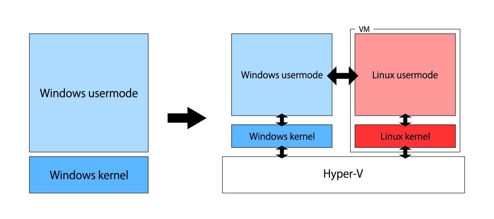

<!--

This document is written in Markdown.
You can preview on such as VisualStudio Code.
If you want to know more, search with "vscode markdown" or refer to official document https://code.visualstudio.com/Docs/languages/markdown .

-->

# WSL2 セットアップ

Windows(Windows10 ver.2004以降)には`Windows Subsystem for Linux`の"バージョン2"、`WSL2`という機能が存在する。従来WindowsではコマンドプロンプトやPowerShellなどのCUI操作が可能である一方でUNIX系のコマンドやオープンソース開発のためのLinuxとの互換が期待されていた。

そこでWindows 10の当初、Windowsのkernel上にLinuxライクなカーネルで構成されていた`WSL`の"バージョン1"が搭載された。しかし、この`WSL1`ではWindows kernel上に載っていることによる様々なボトルネック、そしてそもそもLinux kernelそのものでないことによる互換性の問題があった。

`WSL2`では下記の図右のようにWindowsそのものもHyper-Vという仮想化技術で仮想化しLinuxカーネルそのものを搭載することができるようになった。

これによりWindowsにおけるLinux開発の敷居も下がり、容易にLinuxコマンドも実行することが可能となっている。

またWindows11から(厳密には10のInsider Preview)はWSLgというWindows上にサブシステムのLinuxからのウィンドウを表示することができるようになった。従来もWindows側にX Serverを立てれば可能ではあったがそれを正式にサポートするようになった形である。

ただし、もしWSLを有効化するならば、当然通常よりメモリを消費すること、下の図のようにWindows自身も仮想化することによりWindowsのパフォーマンスも(感じるほどではないが)やや低下するということを頭に入れておきたい。

メモリは8GBでも通常のWindowsの使用には問題がないが限界に近いので16GBは目安として搭載しているほうが良い。




## サブシステムのディストリビューションの概要

サブシステムとして利用可能なLinuxなどのディストリビューションは管理者モードのPowerShellのコマンドからもダウンロード&インストール可能であるが普通はMicrosoft Storeから入れることが一般的だろう。

入れることができるディストリビューションの一例
- Ubuntu
- Debian
- openSUSE

ちなみにWSL有効化前に入れると起動にコケたはずなので先に入れないように気を付ける。

## WSLの有効化・インストール

詳しい説明は公式ドキュメントを参照していただきたい。[WSL の基本的なコマンド](https://docs.microsoft.com/ja-jp/windows/wsl/basic-commands)

やり方は2通り

1. コントロールパネルから

	`コントロールパネル > プログラム > プログラムと機能 > Windowsの機能の有効化または無効化` から
	
	`Linux用Windowsサブシステム`にチェックを入れて有効化し再起動。

	

2. PowerShellから

	PowerShell/Windows Terminalを"管理者として"実行

	```PowerShell
	wsl --install
	```

## WSLのデフォルトバージョンを2に

PowerShell/Windows Terminalを管理者として実行。以下のコマンドを実行

```PowerShell
wsl --set-default-version 2
```

もし変更を忘れても後から変換は可能。詳しくは公式ドキュメントで。

## ディストリビューションのインストール

Microsoft StoreからUbuntuなどを検索してダウンロード&インストール

## WSLのLinux起動

Microsoft Storeからダウンロードしたのでスタートメニューにアイコンが表示されるからそのアイコンをクリックして起動。

もしくは

Windows Terminalのタブの下矢印ボタンから追加したディストロを選択することで起動できる。

## WSLのディレクトリの立ち位置

Windows側のディレクトリはWSLから見ると"Cドライブ"の場合は"/mnt/c"にマウントされる形になっている。しかしWSLのホームディレクトリ"~"は"/home/_YOUR_NAME"なので気を付けていただきたい。

Windowsのデスクトップ上でsource.cを作成し、

WSL Ubuntuでディレクトリを移動し
```
cd /mnt/c/Users/_Your_Name_/Desktop/
```
してから
```
gcc source.c
```
とすれば通常のUbuntu通り、`gcc`が実行できる。当然`gcc`は`apt`でインストールする必要はある。

## WSLgの有効化

説明は公式ドキュメントを参照していただきたい。
[Linux 用 Windows サブシステム (プレビュー) で Linux GUI アプリを実行する](https://docs.microsoft.com/ja-jp/windows/wsl/tutorials/gui-apps)


<!-- Written by Croyfet in 2022-->
